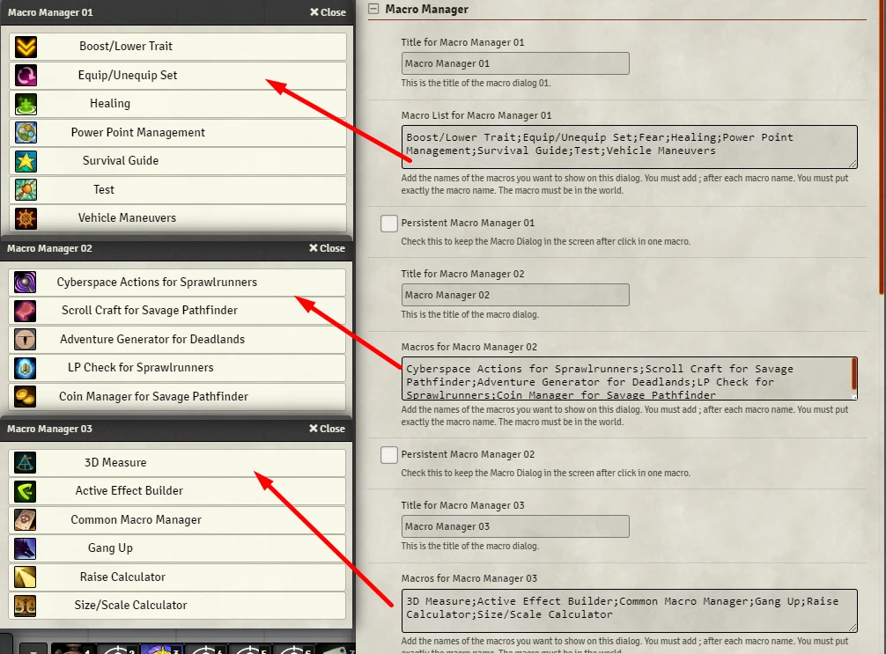

# Macro Manager
This module let you open a dialog with your favorite macros (image bellow). 
This let one hotbar space be used for lots of macros or you can just use a keyboard shortcut without the hotbar.

<p align="center">
  
</p>

## Applications

- Heavy macro users 
- It's alternate way to call your macros or anything that you would use in the hotbar
- You can create a macro set and your players can use them with one call.
- You can create the macro dialog without need to change settings. Check **Custom Macro Manager**.

# Features
Check the module settings to configure Macro Manager.

- You can use up to nine Macro Managers. 
- You can set them to be persistent, they will not close until you click the **Close Button**.
- You can call Summary to know how your macros are organized.
- You can change the font size.
- You can enable keyboard shortcut for players. This will let you create a macro set and let your players call it.
- Nine Macro Managers aren't enough? Create more with **Custom Macro Manager**.

**Summary**
<p align="center">
  
</p>

# How To
You have to configure each macro manager. You do this in the module settings. 
- Go to this module settings. 
- Then, add to the Macro List field the names of the macros in your world.
- The name of the macro in your world MUST be igual to the name you put in these fields.
- After each macro name add **;**. 

**Example**
```
Macro Name 1; Macro Name 15; Weird Macro Name 11; Macro Name 3;
```

<p align="center">
  
</p>

## Macros
To trigger the dialog you can create a macro with the following code. You can switch between the macro manager `replacing the number 1 by 2, 3, 4, 6, 7, 8 or 9`.

```js
const mm = game.modules.get('macro-manager')?.api.mm;
mm.openMacroManager( 1 );
```

You can call the summary with:
```js
const mm = game.modules.get('macro-manager')?.api.mm;
mm.showSummary();
```

### Custom Macro Manager
You can create a Macro Manager directly from code, without need to configure anything in settings.

**Example**
```js
const mm = game.modules.get('macro-manager')?.api.mm;

const title = 'mytitle';
const macroList = "New Macro 1; New Macro 2; New Macro 3; New Macro 4";
const persistent = true; // default is false

mm.openCustomMacroManager( macroList, title );
```

## Keybindings
You can used keybindings to trigger too. 
Use **Shift+1, Shift+2, Shift+3, Shift+4, Shift+5 Shift+6, Shift+7, Shift+8, and Shift+9**.

You can trigger the Summary with **Shift+0**.

You can change these keybindings in **controls settings**.

<p align="center">
  
</p>

# Instalation
You can install this module using the manifest: https://raw.githubusercontent.com/brunocalado/macro-manager/main/module.json

# Localization
If you want to translate this module [DOWNLOAD THIS FILE](https://raw.githubusercontent.com/brunocalado/macro-manager/main/lang/en.json) and translate it. After that open an [issue](https://github.com/brunocalado/macro-manager/issues) sharing your translation. 

You also need to share with me the default name convention for your language. This is very easy to get. 
- Find a system or module which is translated to your language. 
- Open the **module.json** or **system.json** file.
- You should find something like the code above. It's under **languages**. Share with me **lang, name and path** for your language.
```json
{
  "lang": "en",
  "name": "English",
  "path": "lang/en.json"
},
{
    "lang": "fr",
    "name": "Français",
    "path": "lang/fr.json"
}  
```

# TODO
- improve settings menu
- improve macro dialog, size change, columns
- Subheaders: create a way to expand or open a submenu
- send mm macros to hotbar
- send macros in mm to hotbar 
- Read compendium
 
# Community
- Do you have something to improve this module? [Share it!](https://github.com/brunocalado/macro-manager/issues)
- Do you find out a bug? [Report it!](https://github.com/brunocalado/macro-manager/issues)

# Changes
You can see changes at [CHANGELOG](CHANGELOG.md).

# Acknowledgements
- @arcanist#4317 

# License
Code license at [LICENSE](LICENSE).
