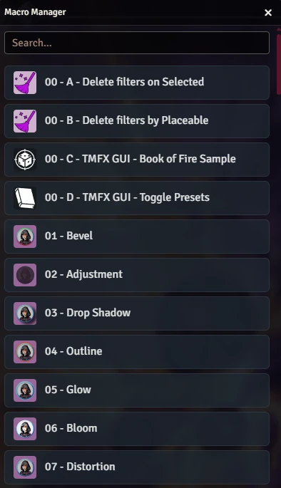
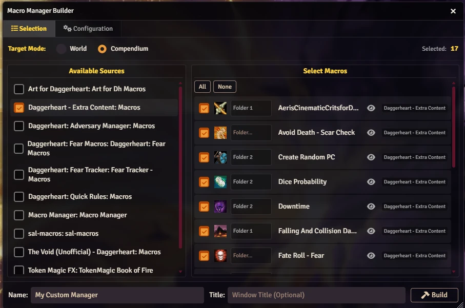

# Macro Manager

**Streamline your workflow.** Macro Manager empowers Game Masters and Developers to create beautiful, searchable, and persistent macro interfaces with a single line of code.

<p align="center"></p>

<p align="center"></p>

Forget cluttered hotbars and complex configurations. Macro Manager provides a clean, API-driven solution to organize your world and compendium macros effortlessly.

## ✨ Features

-   **🔨 Macro Builder:** Create your custom macro managers visually! Select macros from your World or Compendiums and generate the script automatically.
-   **🔍 Searchable Interface:** Instantly find the macro you need with a built-in search bar.
-   **📚 Compendium Support:** Seamlessly integrate macros from any source (World, Modules, Systems).
-   **🎨 Beautiful UI:** A modern, responsive interface with Dark Mode support.

## 📖 Usage & Documentation

### ⚡ Quick Start (The Easy Way)

1.  Open the browser console (F12) or create a script macro.
2.  Run the command:
    ```javascript
    MacroManager.BuildMacro();
    ```
3.  Select the macros you want (from World or Compendiums).
4.  Configure your window settings (Width, Font Size, Persistence).
5.  Click **Build**. A new macro will be created in the "🤖 Manager Macros" folder!

### 💻 Manual Usage (The Code Way)

Detailed instructions, code examples, and API references are available on our Wiki:

👉 **[View the Wiki](https://github.com/brunocalado/macro-manager/wiki)**

## 🤝 Community & Support

-   **Issues:** Found a bug? [Report it here](https://github.com/brunocalado/macro-manager/issues).
-   **Wiki:** Check the [Wiki](https://github.com/brunocalado/macro-manager/wiki) for advanced usage.
-   **Change Log:** See what's new in [CHANGELOG.md](CHANGELOG.md).

---

*Made with ❤️ for Foundry VTT.*