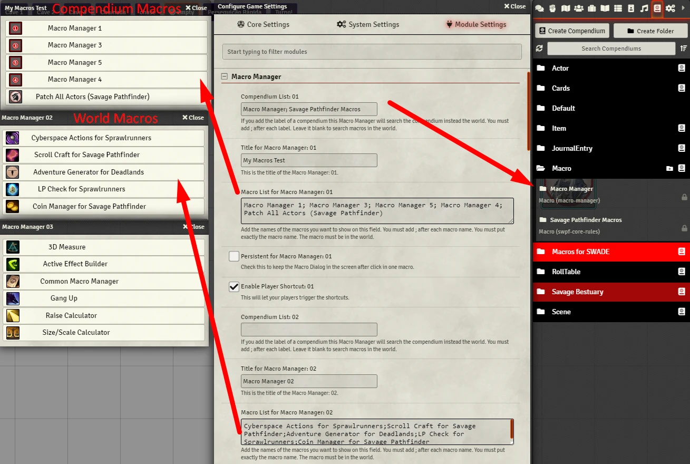
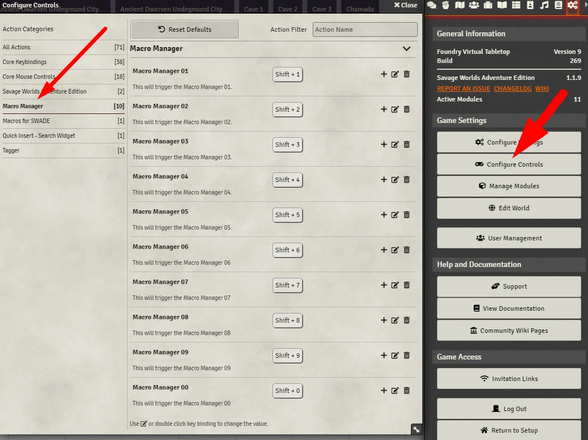
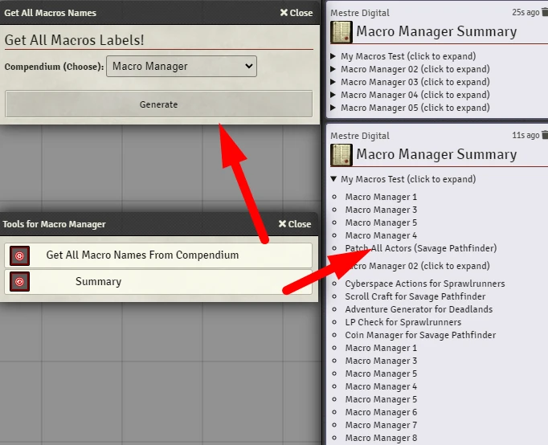

# Macro Manager
This module let you open a dialog with your favorite macros (image bellow). 
This let one hotbar space be used for lots of macros or you can just use a keyboard shortcut without the hotbar.

<p align="center">
  
</p>

## Applications

- Heavy macro users 
- It's alternate way to call your macros or anything that you would use in the hotbar. This can free a lot of hotbar slots.
- You can create share a group of macros with your players.
- You can create the macro dialog without need to change settings. Check **Custom Macro Manager**.
- You can read macros from your compendiums. This avoid populate your world with macros. Useful if you use a macro compendium from one module which got updated, you just read the macro from there, you don't need to import again.
- You can add journals, tables, etc with the module Drag Anything to Hotbar.

# Features
Check the module settings to configure Macro Manager.

- You can use up to nine Macro Managers. 
- Nine Macro Managers aren't enough? Create more with **Custom Macro Manager**.
- You can set them to be persistent, they will not close until you click the **Close Button**.
- You can call Summary to know how your macros are organized.
- You can change the font size.
- You can enable keyboard shortcut for players. This will let you create a macro set and let your players call it.
- You can read macros from a compendium.
- You can sort the list. There is an option in settings.
- You can add headers to organize the macros.
- Theme! You can change the theme of your macro manager!

**Summary**
<p align="center">
  
</p>

# How To
You have to configure each macro manager. You do this in the module settings. 
- Go to this module settings. 
- Then, add to the Macro List field the names of the macros. If these macros are in your world leave the **Compendium List** field in blank. If these macros are in one or more compendiums add the labels of these compendiums to **Compendium List**, separate each one with **;**.
- The name of the macro MUST be igual to the name you put in these fields.
- After each macro name add **;**. 
- You can add ##MY HEADER## to organize your macros.

**Example for Macros in your World**
```
Macro List 01:
Macro Name 1; Macro Name 15; ##MY HEADER##; Weird Macro Name 11; Macro Name 3;
```

**Example for Macros in Compendiums**
```
Compendium List
My Compendium with Macros; Weird Module Macros;

Macro List 01:
Macro Name 1; Macro Name 15; Weird Macro Name 11; Macro Name 3;
```

<p align="center">
  
</p>

## Macros
To trigger the dialog you can create a macro with the following code. You can switch between the macro manager `replacing the number 1 by 2, 3, 4, 6, 7, 8 or 9`.

```js
const mm = game.modules.get('macro-manager')?.api.mm;
mm.openMacroManager( 1 );
```

You can call the summary with:
```js
const mm = game.modules.get('macro-manager')?.api.mm;
mm.showSummary();
```

### Custom Macro Manager
You can create a Macro Manager directly from code, without need to configure anything in settings.

**Example: World Macros**
```js
const mm = game.modules.get('macro-manager')?.api.mm;

const data = {
  "macroList": "Macro Manager 1; Macro Manager 2; Macro Manager 3",
  "title": "my title",
  "persistent": false
}

mm.openCustomMacroManager( data );
```

**Example: Compendium Macros**
```js
const macroList = "Macro Manager 1; Macro Manager 2;Patch All Actors (Savage Pathfinder); Macro Manager 3";
const compendiumList = "Macro Manager; Savage Pathfinder Macros";

// --------------------
const mm = game.modules.get('macro-manager')?.api.mm;

const data = {
  "macroList": macroList,
  "title": "my title",
  "persistent": false,
  "compendiumList" : compendiumList
}

mm.openCompendiumMacroManager( data );
```

## Keybindings
You can used keybindings to trigger too. 
Use **Shift+1, Shift+2, Shift+3, Shift+4, Shift+5 Shift+6, Shift+7, Shift+8, and Shift+9**.

You can trigger the Tools with **Shift+0**. There is useful options like **Summary**.

<p align="center">
  
</p>

You can change these keybindings in **controls settings**.

# Instalation
You can install this module using the manifest: https://raw.githubusercontent.com/brunocalado/macro-manager/main/module.json

# Localization
If you want to translate this module [DOWNLOAD THIS FILE](https://raw.githubusercontent.com/brunocalado/macro-manager/main/lang/en.json) and translate it. After that open an [issue](https://github.com/brunocalado/macro-manager/issues) sharing your translation. 

You also need to share with me the default name convention for your language. This is very easy to get. 
- Find a system or module which is translated to your language. 
- Open the **module.json** or **system.json** file.
- You should find something like the code above. It's under **languages**. Share with me **lang, name and path** for your language.
```json
{
  "lang": "en",
  "name": "English",
  "path": "lang/en.json"
},
{
    "lang": "fr",
    "name": "Français",
    "path": "lang/fr.json"
}  
```

# TODO
- improve settings menu
- send mm macros to hotbar
- send macros in mm to hotbar 
- improve macro dialog
-- Be able to create another column if you reach a number. Example: "10" will drop the macros to another column

# Community
- Do you have something to improve this module? [Share it!](https://github.com/brunocalado/macro-manager/issues)
- Do you find out a bug? [Report it!](https://github.com/brunocalado/macro-manager/issues)

# Changes
You can see changes at [CHANGELOG](CHANGELOG.md).

# Acknowledgements
- @arcanist#4317 

# License and Assets
- Code license at [LICENSE](LICENSE).
- Icons: https://game-icons.net/
