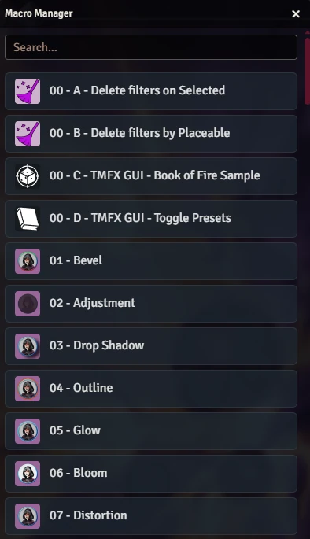
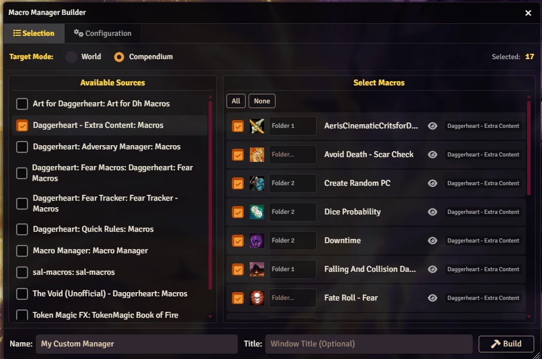

# Macro Manager

**Streamline your workflow.** Macro Manager empowers Game Masters and Developers to create beautiful, searchable, and persistent macro interfaces with a single line of code.

<p align="center"></p>

<p align="center"></p>

Forget cluttered hotbars and complex configurations. Macro Manager provides a clean, API-driven solution to organize your world and compendium macros effortlessly.

[](https://buymeacoffee.com/mestredigital)

## ✨ Features

-   **🔨 Macro Builder:** Create your custom macro managers visually! Select macros from your World or Compendiums and generate the script automatically.
-   **📂 Folder Organization:** Group your macros into collapsible folders directly within the builder or via script syntax for a cleaner layout.
-   **🔍 Searchable Interface:** Instantly find the macro you need with a built-in search bar that filters through both folders and loose macros.
-   **📚 Compendium Support:** Seamlessly integrate macros from any source (World, Modules, Systems) and mix them into custom folders.
-   **🎨 Beautiful UI:** A modern, responsive interface with Dark Mode support and custom visual indicators.

## 📖 Usage & Documentation

### ⚡ Quick Start (The Easy Way)

1.  Create a script macro with:
    ```javascript
    MacroManager.BuildMacro();
    ```
2.  **Select Macros:** Choose macros from your World or switch modes to select from Compendiums.
3.  **Organize:** (Optional) Type a folder name in the text box next to a macro to assign it to a specific group.
4.  **Configure:** Set your Window Title, Width, Font Size, and Persistence preferences.
5.  **Build:** Click **Build**. A new macro will be created in the "🤖 Manager Macros" folder!

### 💻 Manual Usage (The Code Way)

You can manually construct a Macro Manager.

👉 **[View the Wiki](https://github.com/brunocalado/macro-manager/wiki)**

## 🤝 Community & Support

-   **Issues:** Found a bug? [Report it here](https://github.com/brunocalado/macro-manager/issues).
-   **Wiki:** Check the [Wiki](https://github.com/brunocalado/macro-manager/wiki) for advanced usage.
-   **Change Log:** See what's new in [CHANGELOG.md](CHANGELOG.md).

---

*Made with ❤️ for Foundry VTT.*
